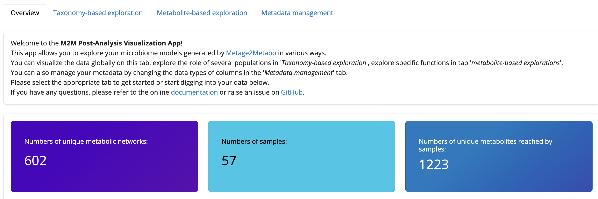

[](https://pypi.org/project/Metage2Metabo/) [](https://github.com/AuReMe/metage2metabo-postaviz/blob/main/LICENSE) [](https://github.com/AuReMe/metage2metabo/actions/workflows/pythonpackage.yml) [](https://metage2metabo-postaviz.readthedocs.io/en/latest/?badge=latest)

# M2M-PostAViz

## Overview

M2M-PostAViz (_M2M Post-Analysis and Visualization_) is an interactive exploration platform for the exploration of metabolic potential predictions performed by [Metage2Metabo (M2M)](https://github.com/AuReMe/metage2metabo/tree/main). M2M predicts reachable metabolites by communities of microorganisms by computing a Boolean abstract abstraction (Network expansion) of metabolic activity. More precisely, it takes as input a collection of genome-scale metabolic networks (GSMNs) and a description of the nutritional environment, then first compute the molecules reachable (predicted to be producible in the environment) by each GSMN individually, and by the community of GSMNs. In the latter case, it takes into account mutualistic interactions (cross-feeding) that may occur within the community, and therefore increase its overall metabolic potential. As such, several outputs can be distinguished: what is produced by each member alone or _individual scope_, what becomes producible only through metabolic interactions _added-value_ and the union of both that is the community metabolic potential, or _community scope_. For each compound in one of the _scopes_, the information related to the producer(s) -- i.e. which GSMNs -- of the compound is retrieved by M2M and provided in dedicated tables. The overview of M2M pipeline is illustrated below:


M2M-PostAViz integrates and analyses all these outputs, especially in a context when multiple runs of M2M are performed, each one aiming at studying the metabolic potential of a microbial community. A typical use-case would be to run M2M for a cohort of microbiome samples, each described by a collection of GSMNs, for instance. In a cohort, the data comes with metadata that is used by M2M-PostAViz to analyse M2M's results and explore whether the predicted metabolic potential is statistically associated with metadata variables. 


### License 
GNU Lesser General Public License v3 (LGPLv3)

## Installation

M2M-PostAViz is tested with Python version 3.10, 3.11 and 3.12.
You can install the application:

- By cloning and installing this repository for the latest version
    ```{sh}
    git clone git@gitlab.inria.fr:postaviz/m2m-postaviz.git # or git clone https://gitlab.inria.fr/postaviz/m2m-postaviz.git
    ```
    Then install the tool:
    ```
    pip install .
    ```

    
- Directly from the last release on Python Pypi with `pip`
    ```
    pip install m2m-postaviz
    ```
    Or as an alternative you can also directly install the in-development version with:
    ```
    pip install git+ssh://git@gitlab.inria.fr/postaviz/m2m-postaviz.git@main
    ```


### Dependencies

<details>
  <summary>Click to expand</summary>
M2M-PostAViz has a few dependencies that are listed below:

- pandas
- padmet
- scipy
- skbio
- plotly
- scikit-bio
- shiny
- shinywidgets
- pyarrow
- seaborn

You can install them with
```
pip install -r requirement.txt
``` 

They should be installed automatically when installing the application though. 

If you use the application for research, do not forget to cite the works associated to those dependencies.
</details>

## Quick start

> **⚠️ Warning:** 
> 
> We assume that you arrive at this step having installed the tool first (see above section), for instance in a Python virtual environment, or conda (mamba) environment.

📁 A dataset with test data is available in this repository in `postaviz_test_data` and can be used to test the main functionalities of the tool.


The test can be run with the following command:

```
m2m_postaviz --test
```

It takes a few seconds to launch because data needs to be uncompressed and processed in a temporary directory.

Shiny will launch automatically afterward.



Once on the homepage you're free to explore the test data.

Note that Metacyc database information related to the ontology of metbolites and pathways is not included in test option.

Tab contents are described below.

##  Documentation

### Input data 

The mandatory input data are the outputs of Metage2Metabo for each sample/microbial community, and the metadata associated to each of them. Additional facultative inputs are advised to gain the most out of the analysis: taxonomy of the genomes associated to the metabolic networks, abundance of these genomes in the samples/community. It is also possible to provide the Metacyc ontology of the metabolic compounds to analyse the predictions at the level of metabolite families. The latter is only relevant if the metabolic networks were obtained with PathwayTools, i.e. are made of compound identifiers that fit the Metacyc database. 

> **💡 Note:** Metage2Metabo has a first pipeline step dedicated to the reconstruction of metabolic networks with Pathway Tools.
>
> If you used `m2m recon`, your metabolic networks are compatible with the Metacyc database and PostAViz can use the Metacyc ontology of compound families. 

In practice, other input data can be provided, included precomputed M2M-PostAViz tables which allow for a much faster restart when rerunning the app on previously analyszed data.

As a summary, for a first run you can provide all individual inputs (📄 below), but once this is processed, M2M-PostAViz can save the pre-processed data for a fast startover later (🚀 below)

We detail below the input data:

- 📄 M2M output for each sample
  - It should be in the following format

     ```
    │   ├── sample_1
    │   ├── community_analysis
    │   │   ├── addedvalue.json
    │   │   ├── comm_scopes.json
    │   │   ├── contributions_of_microbes.json
    │   │   ├── mincom.json
    │   │   ├── rev_cscope.json
    │   │   ├── rev_cscope.tsv
    │   │   └── targets.sbml
    │   ├── indiv_scopes
    │   │   ├── indiv_scopes.json
    │   │   ├── rev_iscope.json
    │   │   ├── rev_iscope.tsv
    │   │   └── seeds_in_indiv_scopes.json
    │   ├── m2m_metacom.log
    │   └── producibility_targets.json
    └──  sample_2
         ├── community_analysis
         │   ├── addedvalue.json
         │   ├── comm_scopes.json
         │   ├── contributions_of_microbes.json
         │   ├── mincom.json
         │   ├── rev_cscope.json
         │   ├── rev_cscope.tsv
         │   └── targets.sbml
         ├── indiv_scopes
         │   ├── indiv_scopes.json
         │   ├── rev_iscope.json
         │   ├── rev_iscope.tsv
         │   └── seeds_in_indiv_scopes.json
         ├── m2m_metacom.log
         └── producibility_targets.json
    ```
- 📄 Metadata associated to samples
  - This file should be a table where the first column is the sample identifier matching the output of M2M. For instance as below

    | smplID    | Age | Country  |
    |-----------|----:|----------|
    | sample_1  |  2  | France   |
    | sample_2  |  30 | Canada   |
    | sample_3  |  68 | Germany  |
  - The expected format is a tabulated file

- 📄 Taxonomy of the MAGs/genomes corresponding to the metabolic networks used in the analysis.
  - This file should be a table where the first column is the identifier matching the IDs of the metabolic networks that were analyses by M2M. For instance as below

    | Genome_ID  | Domain      | Phylum          | Class          | Order           | Family            | Genus      | Species        |
    |------------|------------|----------------|---------------|----------------|-------------------|------------|---------------|
    | MAG_1      | Bacteria   | Proteobacteria  | Gammaproteobacteria | Enterobacterales | Enterobacteriaceae | Escherichia | Escherichia coli |
    | Genome_1   | Bacteria   | Firmicutes      | Bacilli       | Lactobacillales | Lactobacillaceae  | Lactobacillus | Lactobacillus casei |
    | MAG_2      | Archaea    | Euryarchaeota   | Methanobacteria | Methanobacteriales | Methanobacteriaceae | Methanobacterium | Methanobacterium formicicum |

  - The expected format is a tabulated file

- 📄 Abundance of the MAGs/genomes in the samples/communities.
  - Tabulated file. 
  - It will be **normalised by column sum** during processing.
  - Data is used to normalise the Boolean prediction of metabolite producibility (0 non producible, 1 producible) by the relative abundance of the compound producer.

    | identifier | Sample_1 | Sample_2 | Sample_3 |
    |------------|----------|----------|----------|
    | MAG_1      | 12.5     | 8.3      | 15.2     |
    | Genome_1   | 5.8      | 10.1     | 7.6      |
    | MAG_2      | 20.3     | 14.7     | 18.9     |

  - The expected format is a tabulated file
  
- 📄 Metacyc database in padmet format
  - This optional input file is used to take advantage of the ontology of compound categories provided in the Metacyc database. 
  - This input is relevant only if the metabolic networks analysed in M2M were generated with the PathwayTools software.
  - The Metacyc database flat files can be downloaded provided subscription. Once downloaded, they can be integrated into a single file in the padmet format using the following command line 
  ```{sh}
  # install padmet
  pip install padmet
  # move to the directory were the Metacyc data is stored (unzipped). The data is in a directory named by the version of the database, for instance `28.5/data`
  padmet pgdb_to_padmet --pgdb 28.5/data --version 28.5 --db metacyc --output metacyc28_5.padmet
  ```

- 🚀 Precomputed data for M2M-PostAViz
  - This data can be stored when running the tool with the `-o` flag. It will be saved in the directory of your choice and can be loaded for future runs of M2M-PostAViz.

  ```{sh}
    # Run the tool once on the data and provide a path for saving the tables
    m2m_postaviz -d Metage2metabo/samples/scopes/directory/path
                -m metadata/file/path
                -a abundance/file/path
                -t taxonomy/file/path
                -o save/directory/path
    # for future runs, if data has not changed you can simply resume exploration with
    m2m_postaviz -l save/directory/path
    ```


<!-- ### Important

In metadata file the first column must be the sample identification. Preferably named "smplID".

In taxonomy file the first column must be the metagenomes (mgs). Preferably named "mgs". -->

### Usage

Based on the input listed above, `m2m_postaviz` can be run in two ways:

- 📄 🐢 by providing all input data. To avoid doing this at each run -- pre-processing of all data by the application can be quite lengthy if many samples are provided --, we advise users to use the `-o` flag and save the precomputed data for future runs. In that case, users can resume the analysis directly by loading the processed data (see item below). This procedure is needed at least once, for the first run with new datasets, or when datasets are altered. Note that metadata changes do not need to re-run the whole preprocessing: you can directly modify the file in the saved directory.
  
    ```
    m2m_postaviz -d Metage2metabo/samples/scopes/directory/path
                -m metadata/file/path
                -a abundance/file/path
                -t taxonomy/file/path
                -o save/path
                --no-metacyc (Optionnal)
    ```
- 🚀 by providing the preprocessed data

    ```
        m2m_postaviz -l save/directory/path
    ````

<!-- This way is required as least one time to produce all dataframe and save them in -o save/path.

Once the dataframes are produced. Shiny will automatically run from the save/path given in -o option.
You can interrupt the process if you want and run postaviz with -l load option.


Which will directly launch shiny and skip dataprocessing. -->

> **💡 Note:** The preprocessed dataset is stored in a directory in the form of dataframes and files in Parquet format. This format enables an efficient storage and data access by the application
> 
> Below is the structure of the preprocessed directory.
>
 
```
├── saved_data_postaviz
   ├── abundance_file_normalised.tsv
   ├── abundance_file.tsv
   ├── bin_dataframe_chunk_1.parquet.gzip
   ├── bin_dataframe_chunk_2.parquet.gzip
   ├── bin_dataframe_chunk_3.parquet.gzip
   ├── bin_dataframe_chunk_4.parquet.gzip
   ├── cpd_cscope_dataframe_chunk_1.parquet.gzip
   ├── cpd_cscope_dataframe_chunk_2.parquet.gzip
   ├── cpd_cscope_dataframe_chunk_3.parquet.gzip
   ├── cpd_cscope_dataframe_chunk_4.parquet.gzip
   ├── cpd_iscope_dataframe_chunk_1.parquet.gzip
   ├── cpd_iscope_dataframe_chunk_2.parquet.gzip
   ├── cpd_iscope_dataframe_chunk_3.parquet.gzip
   ├── cpd_iscope_dataframe_chunk_4.parquet.gzip
   ├── main_dataframe_postaviz.tsv
   ├── metadata_dataframe_postaviz.tsv
   ├── normalised_abundance_dataframe_postaviz.tsv
   ├── padmet_compounds_category_tree.json
   ├── pcoa_dataframe_postaviz.tsv
   ├── producers_dataframe_postaviz.tsv
   ├── producers_iscope_dataframe_postaviz.tsv
   ├── sample_cscope_directory
   │   ├── Sample1.parquet.gzip
   │   ├── Sample2.parquet.gzip
   │   ├── Sample3.parquet.gzip
   │   ├── Sample4.parquet.gzip
   │   ├── ...
   │   └── Sample1000.parquet.gzip
   ├── sample_info.json
   ├── sample_iscope_directory
   │   ├── Sample1.parquet.gzip
   │   ├── Sample2.parquet.gzip
   │   ├── Sample3.parquet.gzip
   │   ├── Sample4.parquet.gzip
   │   ├── ...
   │   └── Sample1000.parquet.gzip
   ├── taxonomic_dataframe_postaviz.tsv
   └── total_production_dataframe_postaviz.tsv
```

## Application presentation

The application starts in a web browser and enables user to analyse metabolic potential predictions in the light of sample metadata, genome taxonomy and possibly taking genome abundance into account to weight producibility of metabolites. Several tabs dedicated to different analyses can be browsed. 

Users can modify the visualisations and the statistical analyses by selecting and filtering data and metadata. 

We detail below the contents of each tab and the analyses it enables to perform. 

### Overview tab

This tab summarises the dataset and permits a first exploration of it. 
A first summary presents the number of metabolic networks (microorganism metabolic networks) considered, the number of samples and the number of unique metabolites reached in the samples.

The tab displays several plots:

- Number of unique metabolites reached in each community / sample. Metabolites can be either reached by individual community members, reached through interactions by the community, or unreached in a given sample. This plot can be refined by grouping the data using metadata variables. 
- Total number of compounds reached in samples, that can be also refined by metadata, and can take into account the relative abundance of each microorganism producer to weigh predictions. Statistical results comparing metadata groups are provided as a table. Multiple test correction can be applied to the statistical tests. Note that statistical tests depend on the type of the variables. You can change those types in the Metadata tab if needed. 
- Principal Coordinate Analysis (PCoA) of compound production in samples. Visualisation can be filtered using metadata, or the whole PCoA can be performed again using metadata groups.

All data frames used for plot creation, as well as statistical tests and visualisations can be exported by users. 

### Taxonomy-based exploration tab

This tab is dedicated to the exploration of metabolic networks corresponding to the genomes (bins) included in the samples. The tab proposes analyses performed at the scale of individual scopes (compounds produced by individual populations, no need of microbial interactions) and community scopes (compounds that need interactions to become producible).
Users can check the produced compounds for multiple taxonomic levels, according to the taxonomic metadata that is provided as input. In particular, it is possible to consider taxonomic groups, in which case, all metabolic networks corresponding to this group will be taken into account. 

If taxonomy data (`-t` option) is not provided, this tab will be disabled.

Customization of the plot:

- Choice of the taxonomic ranks: all, taxonomic groups (e.g. phylum), or individual genomes.

- Selection within the rank, e.g. one phylum of interest if phylum was selected above. The number of metabolic networks (bins) corresponding to the selection is displayed at the bottom of the box.

- "Filter" enables selecting samples based on a variable of interest from metadata. "Select" restricts the analysis on the samples matching the metadata variable values that are selected.
 
- "Color" permits grouping the samples on a metadata variable.

If checking the box "weigh the producibility value with relative abundance", the normalised abundance data frame will be used for computation instead of the main dataframe. This means that producibility values of compounds by microorganisms will no longer be 0 or 1 but values corresponding to the relative abundance of the microbe. For instance, 0.3 for a producer that represents 30% of the community's relative abundance.

Two plots are generated for the community scope analysis, and two plots for the individual scope analysis (#TODO). 

- The first one depicts as a barplot the number of unique metabolites produced by the selected taxa in the selected samples

- The second plot depicts the relative abundance of the selected taxa in each sample. 

- Plot 3 is a boxplot of the unique metabolites production of each selected bins in their samples. #TODO


> **⚠️ Warning:**
>The "all" option on all sample (No metadata filter applied) can lead to long computational times when working with large datasets. Performances of the application may be impacted.

> **💡 Note:** A text output under the "Go" button shows how many bins are selected to anticipate large calculations. Also, if only one bin (mgs) is selected, the number of samples the bin is present in will be indicated.


<!-- #### Method

The bins exploration present some challenges, it need to retain the production by the bins inside each sample.

The individual production of each bins depends on the bins present (community interaction highlighted by **Meta2metabo**) which also differ from the treatment/condition of the sample.

All of this information can scale poorly if a lot of samples are present in input which is the point of the application: being able to observe from lots of angles large chunks of data.

In order to keep all this valuable data we choosed to use the hard drive and load/manipulate large dataframe by subset using Parquet format. That way RAM memory is not overload, and we can pick what we need from the hard drive, using query similar to a SQL database. -->


### Metabolite-based exploration tab

Plot settings depend on whether Metacyc data is provided as input to the application or not.

If Metacyc data is enabled, each compound is associated to an ontology of compound families, enabling to explore compound producibility at the level of these familes. 

Users may select groups of compounds based on the list of Metacyc categories ordered from the top to the bottom of the tree.
Any category selected will update the following selection menu to a list of all sub-categories that can in turn be selected.
The following field is automatically updated with compounds matching the (sub)-categories. 

Without Metacyc input data, users may directly select their compounds of interest in this third field.

The plots generated will only consider the compounds selected as input.

- Metadata filter and color

    - Metadata filter
    - Plot color and regroup

- Sample filter

    - All (no filter), Inlucde or Exclude from the plots the selection in filter.
    - Metadata column selection. REDUNDANCY WITH METADATA FILTER ?????
    - unique choice of the metadata column previously selected.
    - Automatically filled. Select sample corresponding to previous choices. NO CUSTOM SELECTION BY NAME POSSIBLE !! NONE option in metadata should be enable!!


- Enable row/columns clustering (Only for heatmap) will change column and or row order. Optional and independent from each other.

- Generate statistical dataframe / Should be enable by default / performance 

Plot

- Heatmap

    Heatmap displaying the number of bins producing the compound in the sample.
    Cscope / Iscope / Added Value

- Percentage of samples producing selected compounds

    Divided as Cscope / Iscope

- Boxplot of the production of compounds (Y axis) by sample regrouped by metadata (X axis)

- Stats tests dataframe.

    Wilcoxon / Mann-Whitney tests for factor/categoric data.
    Corrélation test for integers data.

    Tested pair are determined by the metadata input.

    Sample filtering is not applied here.

<!-- #### Method

To produce the plots, m2m-postaviz use several dataframes made in processing part.

The producers_cscope_dataframe and producers_iscope_dataframe are the two main dataframe.
Both are produced by the sum of each rows (bins) in each sample's cscope/iscope and the concatenation of all Pandas Series produced.

That way we have the number of metagenomes producing the compound (columns) for each rows (samples).

The difference between these dataframe (production in community and individual) gives us the added_value dataframe -->

### Metadata management tab

This tab summarises the metadata that was provided as input to the tool.

As main information, it provides the type of each variable as taken into account in M2M-PostAViz.
This type can be changed with the left menu.

Sometime Plotly and seaborn do not treat numeric / non-numeric columns similarly when building plot's axes.


## Development

To run all the tests run::

    tox run -e clean,(pyXXX),report

Note, to combine the coverage data from all the tox environments run:

* Windows

```
    set PYTEST_ADDOPTS=--cov-append
    tox
```

* Other

```
    PYTEST_ADDOPTS=--cov-append tox
```

## Authors

Léonard Brindel and [Clémence Frioux](https://cfrioux.github.io) -- [Inria Pleiade team](https://team.inria.fr/pleiade/) 

### Acknowledgements

- David James Sherman
- Jean-Marc Frigerio
- Pleiade team members